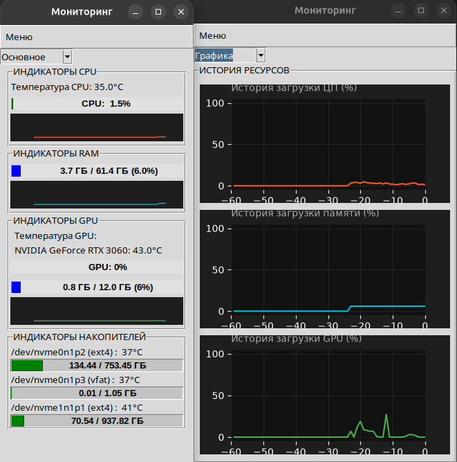

# Monitor CPU RAM GPU

Приложение для мониторинга ресурсов системы: **CPU**, **RAM**, **GPU**, **диски** и **температуры**.

Написано на Python 3 с использованием Tkinter, psutil, matplotlib, pynvml.



## Возможности

- 📊 Загрузка **CPU** (общая + по ядрам), температура
- 💾 Использование **RAM** (в ГБ и %)
- 🎮 Метрики **NVIDIA GPU** (загрузка, память, температура)
- 💿 Информация о **дисках** (объём, файловая система, температура SMART)
- 📈 **Графики истории** загрузки CPU / RAM / GPU
- 🌙 Тёмная тема, компактный интерфейс
- ⚙️ Настройки отображения графиков

## Установка

### Ubuntu 22.04 / 24.04 / 26.04

```bash
# Скачать .deb
wget https://github.com/MALeyman/system-monitor/releases/latest/download/monitor-cpu-ram-gpu_1.0.0_amd64.deb

# Установить
sudo apt install ./monitor-cpu-ram-gpu_1.0.0_amd64.deb
```
```
Установка автоматически:  

✅ Добавляет ярлык в меню приложений  

✅ Устанавливает иконку  

✅ Настраивает NOPASSWD для smartctl и nvme (для температур дисков)  

✅ Устанавливает рекомендованные пакеты: lm-sensors, smartmontools, nvme-cli  
```

## Удалить
```
sudo apt remove monitor-cpu-ram-gpu
```
```
Удаление автоматически:   

✅ Убирает файлы приложения   

✅ Удаляет ярлык из меню  

✅ Удаляет настройку /etc/sudoers.d/monitor-cpu-ram-gpu  
```

## Ручная установка зависимостей (если не установилось автоматически)
```
sudo apt install lm-sensors smartmontools nvme-cli
sudo sensors-detect --auto
```

### **Для работы температур дисков** приложению нужен доступ к `smartctl` без пароля. Это настраивается автоматически через `postinst`-скрипт при установке `.deb`:
 Скрипт создаёт файл `/etc/sudoers.d/monitor-cpu-ram-gpu` с правилом:

<имя_пользователя> ALL=(ALL) NOPASSWD: /usr/sbin/nvme, /usr/sbin/smartctl
Где `<имя_пользователя>` — **логин пользователя, установившего `.deb`** (берётся из переменной `$SUDO_USER` при установке)..

```
Поддерживаемые системы
Система	Статус
Ubuntu 22.04 LTS	✅ Проверено
Ubuntu 24.04 LTS	✅ Проверено
Ubuntu 25.10	✅ Работает
Ubuntu 26.04	✅ Проверено
Debian 12+	✅ Скорее всего
```

### Архитектура: amd64 (x86_64)
```
GPU: NVIDIA (через pynvml). При отсутствии NVIDIA — приложение работает, GPU-панель показывает «NVIDIA GPU не обнаружен».
```
## Сборка из исходников
### Требования
Python 3.10+  

Tkinter: sudo apt install python3-tk  

Docker (для сборки универсального .deb)  

## Локальная разработка 
```
git clone https://github.com/MALeyman/system-monitor.git
cd system-monitor/monitor_CPU_RAM_GPU

python3 -m venv appvenv
source appvenv/bin/activate
pip install -r requirements.txt

python main.py
```
## Сборка .deb через Docker 
```
Docker используется, чтобы собрать бинарник на Ubuntu 22.04 (glibc 2.35). Это обеспечивает совместимость с Ubuntu 22.04+.
```
```
cd monitor_CPU_RAM_GPU

# 1. Собрать образ и извлечь бинарник
docker build -t monitor-build .
docker run --rm -v $(pwd)/dist-old:/out monitor-build \
    cp /build/dist/monitor-cpu-ram-gpu /out/

# 2. Подготовить структуру .deb
cp dist-old/monitor-cpu-ram-gpu packaging/usr/bin/monitor-cpu-ram-gpu
chmod 755 packaging/usr/bin/monitor-cpu-ram-gpu
chmod 755 packaging/DEBIAN/postinst packaging/DEBIAN/prerm

# 3. Собрать .deb
dpkg-deb --build --root-owner-group packaging \
    monitor-cpu-ram-gpu_1.0.0_amd64.deb
```
## Установка собранного .deb
```
sudo apt install ./monitor-cpu-ram-gpu_1.0.0_amd64.deb
```

## Структура проекта
```
monitor_CPU_RAM_GPU/
├── app/                    # Application + controller
├── common/                 # Утилиты: форматирование, метрики
├── providers/              # Провайдеры метрик (cpu, ram, gpu, disk)
├── view/                   # UI: окна, панели, графики
├── assets/                 # Иконки
├── docs/                   # Скриншоты для README
├── packaging/              # Структура .deb пакета
│   ├── DEBIAN/
│   │   ├── control         # Метаданные пакета
│   │   ├── postinst        # Настройка sudoers при установке
│   │   └── prerm           # Очистка при удалении
│   └── usr/
│       ├── bin/            # Бинарник (собирается)
│       └── share/          # Ярлык + иконка
├── Dockerfile              # Сборка на Ubuntu 22.04
├── main.py                 # Точка входа
├── requirements.txt        # Python-зависимости
└── run_app.sh              # Скрипт запуска из исходников
```


### Автор 
Лейман М.А.  

Email: lejman.max@yandex.ru  

GitHub: [MALeyman](https://github.com/MALeyman) 


